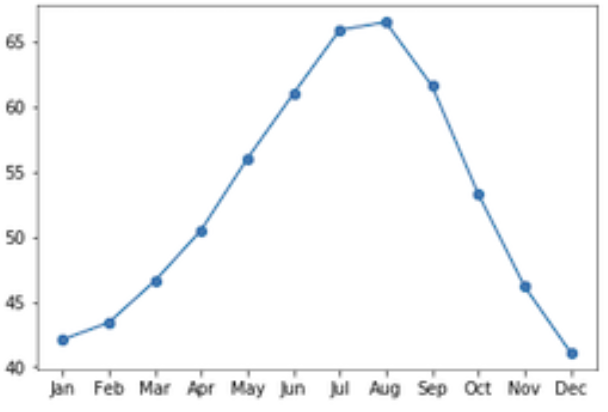
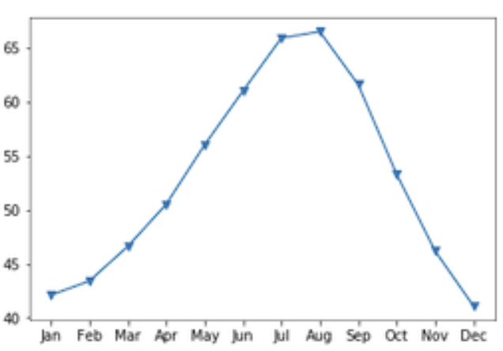
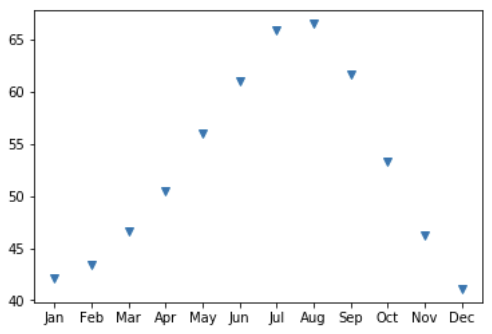
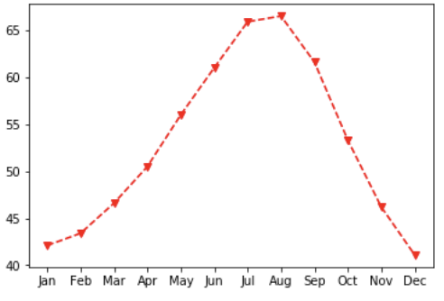
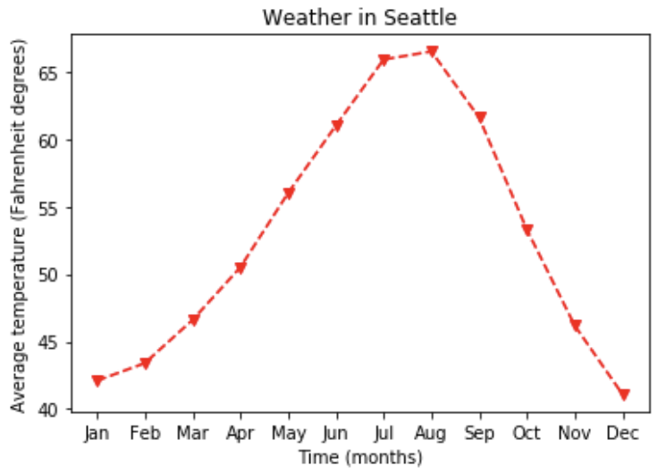

La idea de esté artículo es que el lector aprenda a crear, personalizar y compartir visualizaciones de datos con Matplotlib.

# Introducción a Matplotlib

Las visualizaciones de datos nos permiten extraer conclusiones a partir de los datos y comunicar sobre ellos con otras personas.

Existen muchas bibliotecas de Software para visualizar datos. Una de las principales ventajas de Matplotlib es que te brinda control total sobre las propiedades de los gráficos que desarrollamos.

## Interfaz Pyplot

Hay muchas formas de usar Matplotlib. En este caso, utilizaremos la interfaz principal orientada a objetos. Esta interfaz se ofrece a través del submódulo `pyplot`. Aquí importamos este submódulo y lo nombramos `plt.`

```{python}
import matplotlib.pyplot as plt
fig, ax = plt.subplots()
plt.show()
```

Aunque no es necesario usar el nombre `plt` para que el programa funcione, es una convención muy extendida, y la seguiremos aquí también.

El comando `plt.subplots()`, cuando se llama sin argumentos, crea dos objetos diferentes:

1.  un objeto **fig** (contenedor que agrupa todo lo que se ve en la página ) y
2.  un objeto **ax** (parte de la página que contiene los datos). Es el lienzo sobre el que dibujaremos con nuestros datos para visualizarlos.

Aún no se ha añadido ningún dato.

### Añadir datos a los ejes

Añadamos algunos datos a nuestra figura. Aquí tenemos algunos datos. Este es un DataFrame que contiene información sobre el tiempo en la ciudad de Seattle en los distintos meses del año.

``` python
seattle_weather["MONTH"]
```

{fig-align="left" width="200"}

La columna **MONTH** contiene los nombres de tres letras de los meses del año. Y la columna **MLY-TAVG-NORMAL** contiene las temperaturas de esos meses, en grados Fahrenheit, promediadas a lo largo de un periodo de diez años.

{width="200"}

Para añadir los datos a los ejees, llamamos a un comando de trazado. Los **comandos de trazado** son métodos del objeto `ax`. Por ejemplo, aquí llamamos al método `plot` con la columna **MONTH** como primer argumento y la columna **MLY-TAVG-NORMAL** como segundo argumento. Por último, llamamos a la función `plt.show()` para mostrar el efecto del comando trazado. Este añade una línea al gráfico.

``` Python
ax.plot(seattle_weather["MONTH"], seattle_weather["MLY-TAVG-NORMAL"])
plt.show()
```

{fig-align="left" width="400"}

La dimensión horizontal del gráfico representa los meses según su orden y la altura de la línea en cada mes representa la temperatura media. Las tendencias de los datos ahora son mucho más claras que cuando simplemente leíamos las temperaturas en la tabla.

### Añadir más datos 

Si quieres, puedes añadir más datos al gráfico. Por ejemplo, también tenemos una tabla con datos sobre las temperaturas medias en la ciudad de Austin Texas.

``` Python
ax.plot(austin_weather["MONTH"], austin_weather["MLY-TAVG-NORMAL"])
plt.show()
```

Así es como se vería todo el código para crear esta figura. Primero, creamos los objetos fig, ax. Llamamos al método plot de ax para añadir primero las temperaturas de Seattle y luego las de Austin a los ax. Por último, le pedimos a Matplotlib que nos muestre la figura.

``` Python
fig, ax = plt.subplots()
ax.plot(seattle_weather["MONTH"], seattle_weather["MLY-TAVG-NORMAL"])
ax.plot(austin_weather["MONTH"], austin_weather["MLY-TAVG-NORMAL"])
plt.show()
```

{fig-align="left" width="400"}

## Personalización de Gráficos 

Ahora que ya sabemos cómo añadir datos a una gráfica, vamos a empezar a personalizarlas.

Primero, personalicemos el aspecto de los datos en la gráfica. Una cosa que quizá queramos mejorar es que la gráfica anterior parece continua, pero en realidad solo se midió en intervalos mensuales. Una forma de indicarlo es añadir marcadores a la gráfica que muestren dónde existen datos y qué partes son solo líneas que conectan los puntos de datos.

El método `plot` admite un argumento de palabra clave opcional, marker, que te permite indicar que quieres añadir a la gráfica y también qué tipo de marcadores prefieres. Por ejemplo, pasar la letra minúscula "o" indica que quieres usar círculos como marcadores.

``` Python
ax.plot(seattle_weather["MONTH"], seattle_weather["MLY-PRCP-NORMAL"], marker = "o")
plt.show()
```

{fig-align="left" width="400"}

Si en cambio pasaras una "v" minúscula, obtendriamos marcadores con forma de triángulos apuntando hacia abajo.

``` Python
ax.plot(seattle_weather["MONTH"], seattle_weather["MLY-PRCP-NORMAL"], marker = "v")
plt.show()
```

{fig-align="left" width="400"}

Para ver todos los estilos de marcadores posibles, puedes visitar esta página <https://matplotlib.org/stable/api/markers_api.html> de la documentación en línea de Matplotlib.

### Configuración del estilo de línea

Puedes ir aún más lejos para enfatizarlo combinando el aspecto de estas líneas de conexión. Esto de hace añadiendo el argumento de palabra clave `linestyle`.

``` Python
ax.plot(seattle_weather["MONTH"], seattle_weather["MLY-PRCP-NORMAL"], marker = "v", linestyle = "--")
plt.show()
```

{fig-align="left" width="400"}

Aquí se usan dos guiones para indicar que la línea debe ser discontinua.

Incluso puedes eliminar las líneas por completo pasando la cadena "None" como valor de este argumento de palabra clave.

``` Python
ax.plot(seattle_weather["MONTH"], seattle_weather["MLY-PRCP-NORMAL"], marker = "v", linestyle = "None")
plt.show()
```

{fig-align="left" width="400"}

Por último, puedes elegir el color que quieres usar para los datos. Por ejemplo, aquí hemos decidido mostrar estos datos en rojo, indicado por la letra **"r".**

``` Python
ax.plot(seattle_weather["MONTH"], seattle_weather["MLY-PRCP-NORMAL"], marker = "v", linestyle = "--", color = "r")
plt.show()
```

{fig-align="left" width="400"}

Otra cosa importante que personalizar son las etiquetas de los ejes. Si quieres que tus visualizaciones comuniquen bien, debes etiquetar siempre los ejes. Es realmente importante, pero a menudo se olvida. Además del método plot, el objeto ax tiene varios métodos que empiezan por la palabra set. Y para añadir un título a los ax con el método `set.title()`

``` Python
ax.set_xlabel("Time (months)")
ax.set_ylabel("Average temperature (Fahrenheit degree)")
ax.set_title("Weather in Seattle")
plt.show()
```

{fig-align="left" width="400"}

Todo esto aporta otra fuente de información sobre los datos para dar contexto a la visualización.
