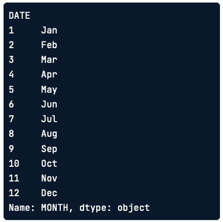
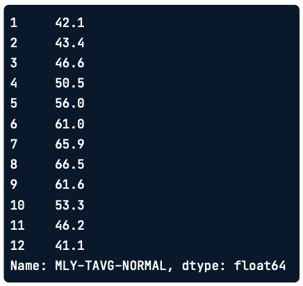
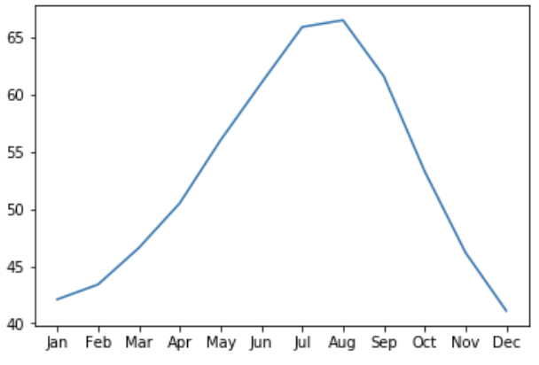
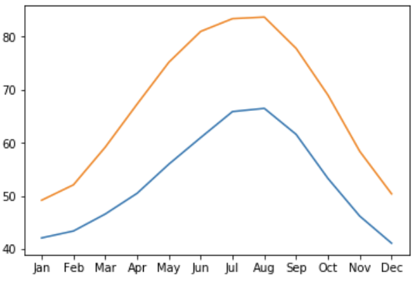

La idea de esté artículo es que el lector aprenda a crear, personalizar y compartir visualizaciones de datos con Matplotlib.

# Introducción a Matplotlib

Las visualizaciones de datos nos permiten extraer conclusiones a partir de los datos y comunicar sobre ellos con otras personas.

Existen muchas bibliotecas de Software para visualizar datos. Una de las principales ventajas de Matplotlib es que te brinda control total sobre las propiedades de los gráficos que desarrollamos.

## Interfaz Pyplot

Hay muchas formas de usar Matplotlib. En este caso, utilizaremos la interfaz principal orientada a objetos. Esta interfaz se ofrece a través del submódulo `pyplot`. Aquí importamos este submódulo y lo nombramos `plt.`

```{python}
import matplotlib.pyplot as plt
fig, ax = plt.subplots()
plt.show()
```

Aunque no es necesario usar el nombre `plt` para que el programa funcione, es una convención muy extendida, y la seguiremos aquí también.

El comando `plt.subplots()`, cuando se llama sin argumentos, crea dos objetos diferentes:

1.  un objeto **fig** (contenedor que agrupa todo lo que se ve en la página ) y
2.  un objeto **ax** (parte de la página que contiene los datos). Es el lienzo sobre el que dibujaremos con nuestros datos para visualizarlos.

Aún no se ha añadido ningún dato.

### Añadir datos a los ejes

Añadamos algunos datos a nuestra figura. Aquí tenemos algunos datos. Este es un DataFrame que contiene información sobre el tiempo en la ciudad de Seattle en los distintos meses del año.

``` python
seattle_weather["MONTH"]
```

{fig-align="left" width="200"}

La columna **MONTH** contiene los nombres de tres letras de los meses del año. Y la columna **MLY-TAVG-NORMAL** contiene las temperaturas de esos meses, en grados Fahrenheit, promediadas a lo largo de un periodo de diez años.

{width="200"}

Para añadir los datos a los ejees, llamamos a un comando de trazado. Los **comandos de trazado** son métodos del objeto `ax`. Por ejemplo, aquí llamamos al método `plot` con la columna **MONTH** como primer argumento y la columna **MLY-TAVG-NORMAL** como segundo argumento. Por último, llamamos a la función `plt.show()` para mostrar el efecto del comando trazado. Este añade una línea al gráfico.

``` Python
ax.plot(seattle_weather["MONTH"], seattle_weather["MLY-TAVG-NORMAL"])
plt.show()
```

{fig-align="left" width="400"}

La dimensión horizontal del gráfico representa los meses según su orden y la altura de la línea en cada mes representa la temperatura media. Las tendencias de los datos ahora son mucho más claras que cuando simplemente leíamos las temperaturas en la tabla.

### Añadir más datos 

Si quieres, puedes añadir más datos al gráfico. Por ejemplo, también tenemos una tabla con datos sobre las temperaturas medias en la ciudad de Austin Texas.

``` Python
ax.plot(austin_weather["MONTH"], austin_weather["MLY-TAVG-NORMAL"])
plt.show()
```

Así es como se vería todo el código para crear esta figura. Primero, creamos los objetos fig, ax. Llamamos al método plot de ax para añadir primero las temperaturas de Seattle y luego las de Austin a los ax. Por último, le pedimos a Matplotlib que nos muestre la figura.

``` Python
fig, ax = plt.subplots()ax.plot(seattle_weather["MONTH"], seattle_weather["MLY-TAVG-NORMAL"])
ax.plot(austin_weather["MONTH"], austin_weather["MLY-TAVG-NORMAL"])
plt.show()
```

{fig-align="left" width="400"}
