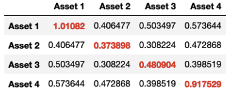
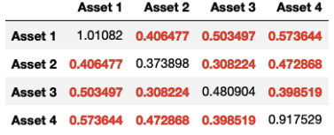
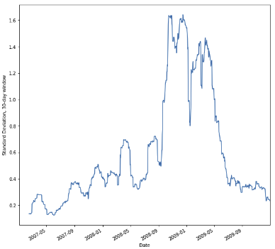
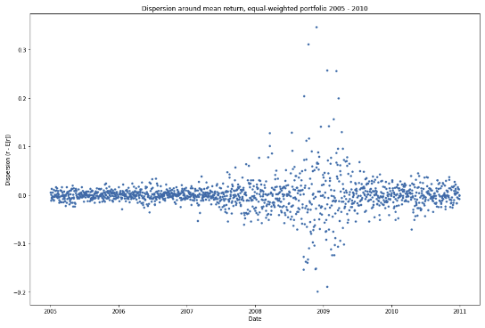

Gestionar el riesgo mediante la gestión cuantitativa de riesgos es una tarea vital en los sectores de la banca, los seguros y la gestión de activos. Es esencial que los analistas de riesgos financieros, los reguladores y los actuarios puedan equilibrar cuantitativamente las recompensas con su exposición al riesgo.

Este artículo presenta la gestión del riesgo de portafolios financieros mediante un examen de la crisis financiera de 2007-2008 y su efecto en bancos de inversión como Goldman Sachs y J.P.Morgan. Aprenderás a utilizar Python para calcular y mitigar la exposición al riesgo utilizando las medidas Valor en Riesgo y Valor en Riesgo Condicional, a estimar el riesgo con técnicas como la simulación Montecarlo y a utilizar tecnologías de vanguardia como las redes neuronales para equilibrar el portafolio en tiempo real.

# Resumen de Riesgos y Rentabilidades

La gestión del riesgo empieza por comprender el riesgo y la rentabilidad. Recapitularemos cómo se relacionan entre sí el riesgo y la rentabilidad, identificaremos los factores de riesgo y los utilizaremos para volver a familiarizarnos con la teoría del portafolio moderna aplicada a la crisis financiera mundial de 2007-2008.

> La gestión de riesgos es la ciencia de mitigar el impacto de resultados adversos. Cuantificamos la incertidumbre mitigando el riesgo.

La medición del riesgo identifica factores que pueden crear resultados adversos en el futuro. Esto es como identificar las principales causas de un incendio al crear un seguro contra incendios: utilizamos cosas como causas históricas de incencidio, así como las características de las viviendas propensas a incendiarse, con el fin de llegar al mejor seguro posible.

En este artículo, cuantificaremos los factores que afectan el riesgo de las carteras financieras.

Nos concentraremos en un período tumultoso de la historia de la humanidad: la *"Gran Recesión de 2007-2008" ,* cuando se perdieron billones de dólares de crecimiento y riqueza en un período de tres años. Este fue un período de cambios a gran escala en los activos fundamentales, lo que genera incertidumbre y una alta volatilidad en los retornos de los activos. La gestión de riesgos fue crucial para salvar (o en algunos casos, no salvar) tanto a los bancos como a las empresas privadas.

**Una cartera financiera** es un conjunto de activos con rendimientos futuros inciertos. Los ejemplos incluyen acciones, bonos y tenencias de divisas, o "forex", otros activos más complicados incluyen las opciones sobre acciones, que analizaremos más adelante.

Para las carteras financieras, cuantificamos el riesgo para poder realizar estrategias de inversión óptimas que maximizan el rendimiento de una cartera, condicionando a un nivel de riesgo que podamos tolerar (conocido como *"apetito de riesgo"*).

Recuerde que el rendimiento de una cartera es la suma ponderada de los rendimientos de los activos dentro de una cartera. Podemos encontrar fácilmente este retorno colocando los datos de precios de nuestros activos en un **DataFrame** de `Pandas`.

``` Python
prices = pandas.read_csv("portfolio.csv")
returns = prices.pct_changes()
weights = (weight_1, weight_2, . . )
portfolio_returns = returns.dot(weights)
```

**`pct_change():`** método para calcular el rendimiento o returno.

Recuerde que el rendimiento de la cartera es el producto escalar de las ponderaciones dela cartera y los rendimientos.

### Cuantificación del Riesgos 

Cuantificamos el riesgo a través de la volatilidad del rendimiento de una cartera. Una vez que tenemos la lista de los activos de una cartera, podemos calcular la volatilidad. Esto normalmente se hace encontrando la matriz de covarianza de todos los activos `.cov()`, y anualizar mutiplicando por el número de días de negociación (aquí 252).

``` Python
covariance = returns.cov()*252
```

Recuerde que la diagonal de la matriz de covarianza es la varianza del activo individual,

{fig-align="center"}

mientras que los elementos fuera de la diagonal son las covarianzas entre los activos.

{fig-align="center"}

### Riesgo del Portafolio 

Para encontrar el riesgo del portafolio o cartera es necesario identificar sus ponderaciones o pesos.

La varianza de la cartera es una función cuadrática de los pesos dados a la matriz de covarianza

$$
\sigma_{p}^2 = w^T\cdot Cov_p\cdot w
$$que se puede calcular en Python utilizando el operador @ .

``` Python
weights = [0.25, 0.25, 0.25, 0.25]
portfolio_variance = np.transpose(weights) @ covariance @ weights
portfolio_volatility = np.sqrt(portfolio_variance)
```

La varianza generalmente se transforma en desviación estándar, lo que genera la volatilidad de la cartera.

Tanto la varianza como la desviación estándar se utilizan como medidas de volatilidad.

### Volatilidad - Series de Tiempo

Puede ser útil observar cómo cambia la volatilidad de la cartera a lo largo del tiempo. Podemos crear una ventana de un período de tiempo fijo, como una semana o un mes, utilizando el metodo `rolling()`.

``` Python
windowed = portfolio_returns.rolling(30)
volatility = windowed.std()*np.sqrt(252)
volatility.plot().set_ylabel("Standard Deviation...")
```

{fig-align="center" width="300"}

Tomando la desviación estandar y anualizandola se obtiene un tiempo de volatilidad.

### Factores de Riesgo y Crisis Financiera 

Acabamos de repasar cómo cuantificar el rendimiento y el riesgo de una cartera. A continuación examinaremos los factores de riesgo de la cartera durante la crisis financiera mundial.

### Factores de Riesgo

La cuantificación del riesgo implica la volatilidad, una medida de la dispersión de los rendimientos de la cartera en torno a una expectativa de lo que serán los rendmientos, tomando el rendimiento promedio de la muestra como la expectativa.

{fig-align="center" width="400"}

Pero **¿ qué variables o eventos afectarán la expectativa y la dispersión de los retornos?** Estas variables o eventos se conocen como factores de riesgo de una cartera. La exposición al riesgo de una cartera es la posible pérdida de la cartera debido a la volatilidad del rendimiento.

Piense en la exposición al riesgo como el impacto negativo potencial de un futuro incierto. Por ejemplo, usted puede asegurar su casa contra inundaciones, pero tener que pagar usted mismo una cantidad de pérdida inicial. Esto se llama deducible. Si el resto del daño causado por una inundación está totalmente cubierto por el seguro, su deducible es su exposición al riesgo. Construir una casa en una zona que se inunda con frecuencia aumenta el riesgo, lo que aumenta su deducible debido a la mayor exposición al riesgo.

### Riesgo sistemico 

Podemos clasificar la exposición al riesgo utilizando factores de riesgo. Algunos factores de riesgo afectan a todos los activos de la cartera de la misma manera. Esto se llama riesgo sestemático. Si se basa en una agregado del mercado, esto se llama riesgo de mercado. Imagínese estar en una avión cuando uno de los motores falla. Este fallo afecta a todos los que están en el avión, por lo que es un ejemplo de riesgos sistemático.

El nivel de precios de una economía es un factor de riesgo sistemático para una cartera de bonos, porque a mayor inflación se traduce en menor rendimiento.

El tipo de interés de una economía tambien es un factor de riesgo sistemático. Porque cambia el costo de oportunidad de invertir en bonos y acciones.

Un auge o una recesión económica afecta a los activos de manera sistemática, impulsando índices de mercado amplios como el S&P 500 o el Dow Jones Industrial Average suben o bajan.
